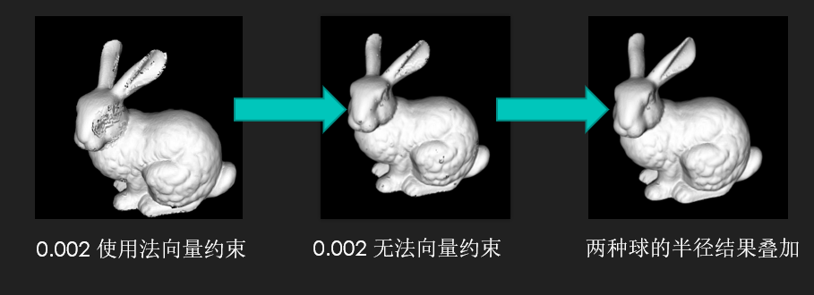

# 图形学大作业实验报告

软件51 谢运帷 2015013185 & 张席博 2015013192

---

### 一、实验选题【三维点云的重建算法】：

我们的选题参考了Berkeley CS184图形学课程的推荐选题https://cs184.eecs.berkeley.edu/article/33 ，目标是完成一个三维点云重建成网格的算法。选题介绍中给出了两篇参考文献：第一篇为The **Ball-Pivoting Algorithm** for Surface Reconstruction 1999；第二篇为**Poisson** Surface Reconstruction 2006。经过我们的学习，第一篇文章滚球的原理相对简单，而第二篇文章泊松重建算法较为复杂，我们实在没有难以复现。最终我们决定实现第一篇文章提出的滚球算法，并进行对比实验。

---

### 二、实验代码&数据集：

我们的代码托管在：https://github.com/AlexsaseXie/BPA-implement

我们实验中使用的数据集可以在http://www.cc.gatech.edu/projects/large_models/ 下载，此数据集是原扫描数据集重采样的结果。这是由于我们实现的算法效率上不可能和原文的一样，机器的效率可能也完全无法相比，不能在原有的扫描数据集上执行。

我们主要使用了上面的兔子和马两个模型。兔子有35947个顶点，马有48485个顶点。

---

### 三、实验分工：

谢运帷：BPA算法的搭建，代码优化

张席博：进行实验，代码优化

---

### 四、实验算法原理：

由于三维的原理图不好画，作者在文中画出了一个二维的原理图，我们可以简单地把它类比到一个三维问题上：

我们在一个三维的点云重建成网格的问题，可以类比成二维点云重建成多边形的问题。在二维的情形下，我们在原始的二维点云找到一个起始圆，这个圆应该是一个位于边界上的圆，其中只包含两个顶点。随后，我们让这个圆不断地滚动，每接触到一个新的顶点，就把它和之前的顶点连接起来，构成一条新的边。不断这样进行下去，我们就获得了图(a)的结果。对应到三维中，我们就是先在表面上取三个点构成一个表面球，再让这个表面球延三条边的方向不断的滚动，不断构成新的三角网格。但是，也有和理想中不相符的情况：滚球算法高度依赖球的半径和点云的均匀性。如图(b)，点云如果出现了不均匀的情况，那么我们就可能无法将球滚动到下一个点处，重建结果出现孔洞；如图(c)，由于我们的球的半径过大，一些尖锐的坑的位置，我们可能会失去这样的特征。

基于上述的思路，滚球算法给出了整个算法的流程：

其中两个重要的过程是：find_seed_triangle：在点云中找到三个点，这三个点决定的球位于点云的表面上；ball_pivot($e_{ij}$)：将表面球沿$e_{ij}$边滚动，寻找下一个接触点$e_k$。整体的流程可以概括如下：在我们滚动的同时，我们将无法再进行滚动的边标志为不活跃。每一次，我们从队列中选取一条活跃的边$e_ie_j$，尝试让它滚动，如果我们找到了一个新的接触点$e_k$，我们就把$e_ie_k$和$e_ke_j$两条新的可能的活跃边加入到队列中。如果没有活跃的边了，那么说明我们已经计算好了一个连通分支，我们需要从点云中未使用过的点中，再找到一个种子球去滚动出另一个连通分支了。

---

### 五、算法实现和遇到的问题：

我们按照论文的介绍实现了滚球算法，但是却遇到了一些问题：

第一个就是点云重建结果缝隙太多，而我们加大球的半径之后，部分缝隙并没有明显的好转。

上图是我们使用r = 0.0012的半径的重建结果。当我们使用r=0.002后，结果如下：

我们发现，兔子腿部的孔洞消失了，耳朵边缘变得没那么尖锐了，这是我们将球半径变大后应该获得的结果。然而，兔子眼部的孔洞却似乎变得更严重了。这个问题困扰了我们很久，经过很长时间的调试结果发现：这是由于我们的法向量估计不对导致的！由于兔子是重采样的，对于它眼部的法向量估计不对，导致眼部的球在滚动时，原本正确的滚动，却因为法向量的约束，让这次滚动被忽略掉了！另外一个原因，是我们队列的实现策略问题，原本的 策略是将新的边插入到队列的前面，我们将新的边插入到队列的后方之后，眼睛的问题也明显好转了。

除此以外，我们还遇到了第二个问题。当我们按照原文给出的算法进行实现时，我们遇到了一个循环滚动的问题：

比如某一初始三角形ABO，ABOF四点是共球的，由于选择球的范围鲁棒性选择了球ABO作为种子。当它的边BO进行滚动时，它滚动到了C，随后依次滚动到了D、E、F，当滚动到F时，OF边再一次滚动到了B点。而BO边恰好不在队列F中，我们又一次把BO边作为活跃边加到了队列中。这样，就形成了无限滚动的情形。当然， 如果我们验OF滚动时，滚动到A点的话，由于AO处于队列中，由算法的glue操作，两条边都会被消除。但正是由于这种四点共球问题，我们的滚动算法就没有办法很好的解决这种无限滚动问题。

---

### 六、算法的修正与优化：

首先，我们必须解决这种共球问题，于是，我们不能按照原算法给出的删除操作来执行glue。我选择将删除替换成改为不活跃，这样我们虽然损失了一些算法复杂度（因为我们需要在队列中进行查询操作，如果边都保留的话，查询的效率会下降），但是我们至少保证了算法的鲁棒性和正确性。

针对第一个问题，我们提出两种优化方案：

第一，我们选择去除滚动时的法向量约束：滚动时的法向量约束的意义主要是降低算法的复杂度，并且杜绝一些完全错误的滚动。但实际上，我们认为，在扫描/重采样模型上。球在表面上滚动时，是不会因为滚动而导致法向量出现反向的。在扫描/重采样模型，我们的模型只有一层点云，这一层点云都是属于物体的表面的，我们不需要进行法向量的约束来避免从一层表面滚动到另一层表面的问题。我们在实际操作中抛弃了法向量在滚动时的约束，只让它约束我们选择种子点。这样，我们在兔子模型上，眼部的重建效果急剧变好。（这也证实了是因为法向量估计不准导致的眼部重建效果不好！）

第二，我们实现了多次滚动结果的叠加。我们使用不同的球去滚动出兔子的表面，并且两个网格求并作为我们最后的结果。这是十分有理论依据的：小的球半径可以保留尖锐的特征，大的球半径可以保证更少的孔洞。两者叠加会使我们的实验结果更好。

---

### 七、算法的运行效率与效果图：

我们的运行效率完全没法达到论文给出的3s重建36万个点的兔子模型。我其实很好奇它是怎么实现的QAQ。但是由于年限较久远，已经无法获得他们的代码。我们算法重建兔子模型（3.6k的点）一次的时间大约是15-20s。

下图给出我们重建的结果：

可以发现，我们去除法向量约束后，眼部明显变好。我们再使用0.0012半径的重建结果和其叠加之后，耳朵处的锯齿基本消失，整体模型无明显问题！

类似地，我们的马儿效果也变好了很多。具体表现为缝隙减少，整体更加有骨感（尖锐位置的特征更明显了）！

---

### 八、实验总结和思考

本次我们实现的算法效果上基本可以达到要求，但是时间效率上还差的很远。不过我们尝试了很多优化时间的方案，也没有得到很好的效果。我们现在的算法绝大部分都采用了牺牲空间换时间的方式，但是还是不能优化的很好。通过测量我们认为，绝大部分的时间都花在了KD-tree的查询上。但KD-tree的查询已经是很有效率的查询方式了，我们没有找到很好的优化它的方式。

我们也尝试着运行了Poisson重建的结果，在我们的数据模型上效果极差：

不但耳朵合并（这个是Poisson的特征，尖锐部分趋向于合并），还有很多法向量估计不准的地方都出现较大的脓包QAQ。

我们总结一下滚球算法：**滚球重建算法高度依赖滚动的球的半径，也高度依赖点云的均匀性！另外，法向量是一个很重要的输入，但往往估计不准，这也是这个算法的瓶颈之一。**

另外一个功能点：自动给出点云的推荐球半径，这个不想实现了，感觉意义并不是很大。

再另外一个功能点：完成另一个重建算法，完成不了了。

---

### 九、代码编译和运行

我使用的编译环境：Win10 + MSVS2015 + PCL 1.8.1 不过实际上并没有用PCL什么复杂功能，你使用PCL啥版本大概都可以，只要正确配置编译路径就能运行。配置可以参考这篇博客http://blog.sina.com.cn/s/blog_817fdf130102xy2t.html。

代码运行：需要的库实在太多了，我没法一个个弄进来了。希望你配置一下PCL（不配置运行不了）。。。。。

2种球重建: xxx.exe (xxx.ply r1 r2)

1种球重建：xxx.exe (xxx.ply r1)

括号内可以不填，代表使用默认参数，默认为bunny.ply，r1 = 0.002。其中bunny.ply要放在exe同级目录下。

不过实际上也并没什么好运行的！！！！看看上面的讨论和源代码就好了，谢谢助教大哥/大姐。

